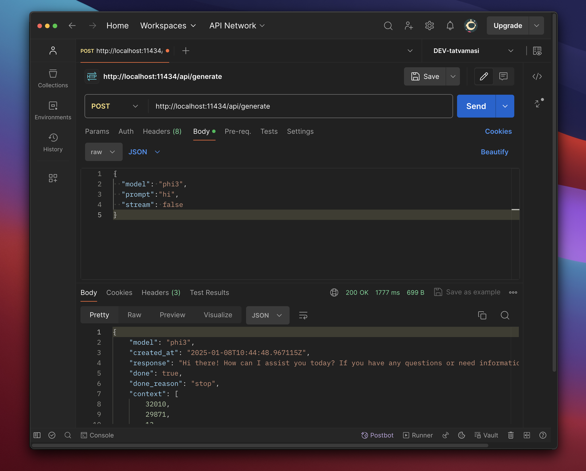

# **Ollama Bootcamp**   

<v-click>

  

  ## **Module 01**
  

</v-click>

  <v-click>

  

  ### 1. Working with models locally
  

  </v-click>

  <v-click>

  

  ### 2. Prompting techniques
  

  </v-click>

  <v-click>

  

  ### 3. Chain-of-Thought (CoT) Prompting: Guiding Reasoning
  

  </v-click>

    <carbon:arrow-right />

---
transition: fade-out
title: Working with models locally
colorSchema: 'dark'
layout: two-cols-header
layoutClass: gap-16
---

# Working with models locally

<v-click>

##  2 methods to work with the LLM
</v-click>

::left::

<v-click>

##  REPL using terminal

  

</v-click>

::right::

<v-click>

##  API calls using REST client

  

</v-click>

 

<!-- API documentation: https://github.com/ollama/ollama/blob/main/docs/api.md -->

---
transition: fade-out
title: Prompting techniques - basics
colorSchema: 'dark'
layout: two-cols-header
---

# Prompting techniques - basics

::left::

<v-click>

##  👎 Bad Prompt Example

> Write a story for me

<v-click>

- Story about what? (context) 
</v-click>

<v-click>

- How long should the story be?  
</v-click>

<v-click>

- Which genre?  
</v-click>

</v-click>

::right::

<v-click>

##  👍 Good Prompt Example

> Acting as an expert storyteller, write a 500-word fantasy story set in a medieval kingdom where a young blacksmith's apprentice discovers a magical sword that can only be wielded by someone with a pure heart. Include elements of adventure, a quest to save the kingdom from an evil sorcerer, and a moral lesson about courage and integrity. Use a third-person narrative style and ensure the story has a clear beginning, middle, and end.

</v-click>

 

---
transition: fade-out
title: Prompting techniques - best practices
colorSchema: 'dark'
layout: two-cols-header
---

# Prompting techniques - best practices

::left::

<v-click>

##  👍 Good Prompt Example

> Acting as an expert storyteller, write a 500-word fantasy story set in a medieval kingdom where a young blacksmith's apprentice discovers a magical sword that can only be wielded by someone with a pure heart. Include elements of adventure, a quest to save the kingdom from an evil sorcerer, and a moral lesson about courage and integrity. Use a third-person narrative style and ensure the story has a clear beginning, middle, and end.

</v-click>

 

::right::

  <v-click>

  ### 1. **Providing Context**   
  </v-click>
  <v-click>

  ### 2. **Specifying Role**   
  </v-click>
  <v-click>

  ### 3. **Defining Task**   
  </v-click>
  <v-click>

  ### 4. **Detailing Desired Output**   
  </v-click>
  <v-click>

  ### 5. **Encouraging Creativity**   
  </v-click>

---
transition: fade-out
title: Prompting techniques - zero-shot
colorSchema: 'dark'
---

# Prompting techniques - Zero-Shot prompting

<v-click>

## title

</v-click>

  
<v-click>

## sub-title 🎉   
</v-click>

  <v-click>

  ### 1. point 1   
  </v-click>
  <v-click>

  ### 2. point 2   
  </v-click>
  <v-click>

  ### 3. point 3
  </v-click>

---
transition: fade-out
title: Prompting techniques - one-shot
colorSchema: 'dark'
---

# Prompting techniques - One-shot prompting

<v-click>

## title

</v-click>

  
<v-click>

## sub-title 🎉   
</v-click>

  <v-click>

  ### 1. point 1   
  </v-click>
  <v-click>

  ### 2. point 2   
  </v-click>
  <v-click>

  ### 3. point 3
  </v-click>

---
transition: fade-out
title: CoT Prompting - guided reasoning
colorSchema: 'dark'
---

# CoT Prompting - guided reasoning

<v-click>

## title

</v-click>

  
<v-click>

## sub-title 🎉   
</v-click>

  <v-click>

  ### 1. point 1   
  </v-click>
  <v-click>

  ### 2. point 2   
  </v-click>
  <v-click>

  ### 3. point 3
  </v-click>

---
transition: fade-out
colorSchema: 'dark'
title: Thank you
layout: center
---

## Thank you 🙏 🤗